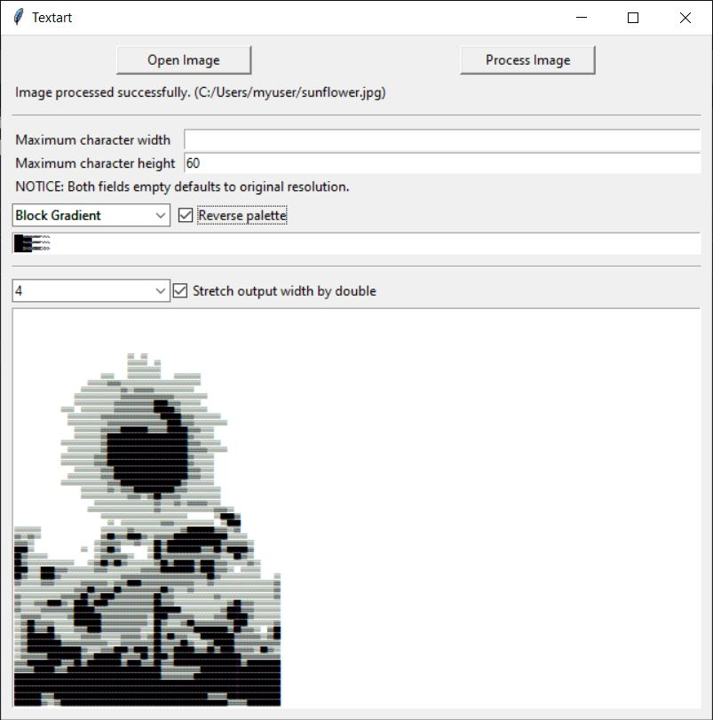

# Textart
This is a small python GUI program that can convert an image into (ASCII) text art. Current features of the program include different palettes of text characters to render the text art with, and the ability to specify character width and height constraints on the image to render just the right size.

## Requirements
- This program requires the [Pillow](https://pypi.org/project/Pillow/) library to be installed, which can be done with the following command:  

  ```
  pip install Pillow
  ```

  Or using the `requirements.txt` file.

  ```
  pip install -r requirements.txt
  ```

- Tkinter
- Python 3.8 and above
## Usage
The program can be launched from the command line by calling python on the textart package. Doing so will bring up the GUI.  

```
python textart
``` 

An image can be read by the gui and converted into textart that can be then copied from the text box.



The textart output will always maintain the aspect ratio of the original image, but can be constrained to a maximum width or height to prevent the output from becoming too large. The above example is constrained to a maximum height of 60 characters and is displayed with a font size of 4 pts. Moreover, a palette can be chosen and reversed to stylize the ouput.

Below is the original sunflower image sourced from [here](https://unsplash.com/photos/5lRxNLHfZOY?utm_source=unsplash&utm_medium=referral&utm_content=creditShareLink) used in the above example. 

